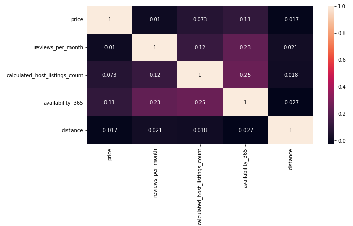

### Model AirBnB prices in Berlin

The model predicts AirBnB prices in Berlin with the dataset taken from [Kaggle](https://www.kaggle.com/datasets/brittabettendorf/berlin-airbnb-data). At the moment two approaches are developed: multiple linear regression and XGBoost. 
For both methods the dataset is separated into 15 parts and a separate model is developed for each part. The figure below shows the feature correlation map.

XGBoost outperforms multiple linear regression. 

|      | MLR  | XGBoost |
|------|------|---------|
| RMSE | 41.8 | 26.9    |
| MAE  | 18.1 | 10.8    |
